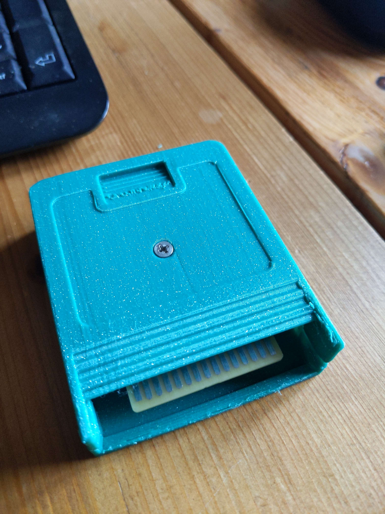
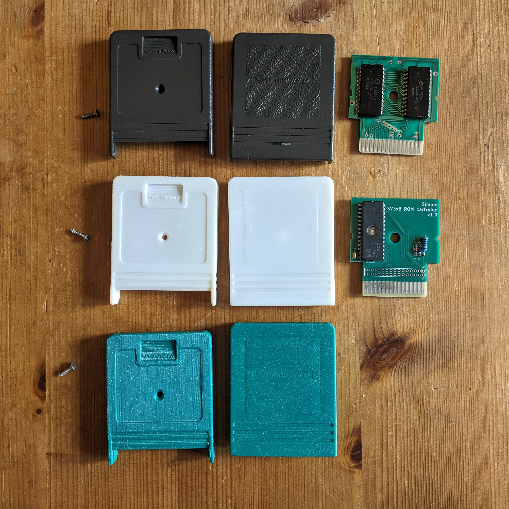
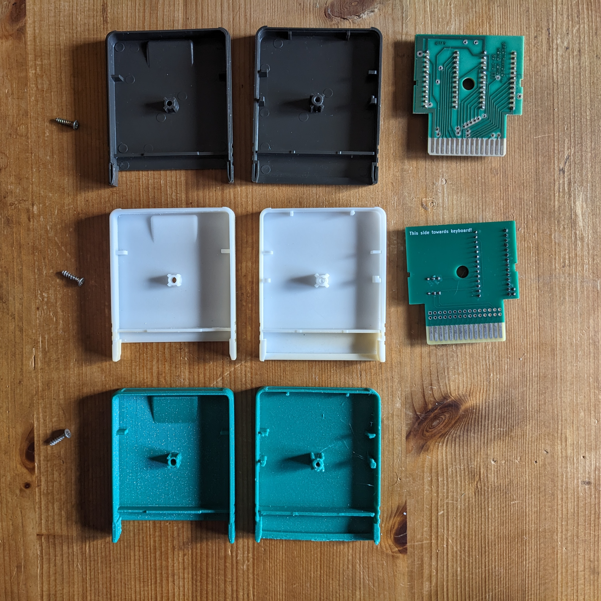

# SV3x8-SimpleCart
This is a simple 32kB cartridge for Spectravideo [SVI318](https://en.wikipedia.org/wiki/SV-318) and [SVI328](https://en.wikipedia.org/wiki/SV-328) computers.

## The PCB
You can preview the KiCad project on [KiCanvas](https://kicanvas.org/?github=https%3A%2F%2Fgithub.com%2FJensRestemeier%2FSV3x8-SimpleCart%2Ftree%2Fmain%2FKiCad).
The PCB is based on an original Cross Force cartridge, that was designed for 16kB mask ROMs. Modifying it for 16kB EPROMs would've required a lot of changes, so in the end I decided to design a PCB for a single 32kB EPROM. Two of the /CS signals need to be combined to produce a single /CS signal, in this case I'm using [diode logic](https://en.wikipedia.org/wiki/Diode_logic) that seems to be popular on [C64 cartridges](https://github.com/bwack/Versa64Cart) for a similar purpose. The outline matches an original PCB, so would fit an original shell.
The Gerber files can be sent to a PCB manufacturer of your choice.

## The shell
The STL directory contains files suitable for 3D printing, either on your own resin or FDM printer or from a service of your choice. It is based on my Cross Force cartridge as well, and reasonably close. I didn't include draft angles, so the STL files are not useful to create injection molds.

## Labels
SVG labels for a few games are in the label folder. Contributions welcome.

## Pictures
The gray cartridge is an original, the white cartridge is a resin print of a slightly earlier version, the green cartridge is a PLA print.

